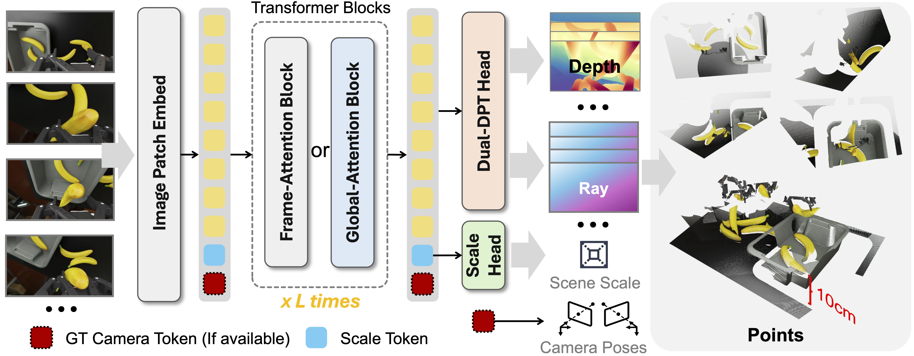

<div align="center">

<h1>DA-Next: Metric-Scale Visual Geometry on Top of Depth Anything 3</h1>

<a href="https://github.com/Livioni/SpatialBenchPage"></a>
<a href="https://github.com/ByteDance-Seed/Depth-Anything-3"></a>
<a href="LICENSE"></a>

</div>

> **Note**: This directory is a **git submodule** of [SpatialBench](https://github.com/Livioni/SpatialBenchPage). Environment setup, dataset download, and the evaluation harness are documented in the parent README.

<div align="center">
  
</div>


## 🔍 Overview

DA-Next is the variant of [Depth Anything 3](https://github.com/ByteDance-Seed/Depth-Anything-3) used as the **`Ours`** entry in the SpatialBench leaderboard. Compared to vanilla DA3, DA-Next adds:

- A **scale head** that predicts metric scale directly from the backbone features (depth supervision must be in meters).
- Training scripts and configuration with mixed-precision (`bf16`), gradient checkpointing, dropout for the pose prior, and a multi-resolution schedule.

## 📁 Repository Layout

```
DA-Next/
├── src/depth_anything_3/        # model code (backbone, heads, configs)
│   ├── configs/                 # model YAMLs (e.g. da3-giant-metric.yaml)
│   └── model/                   # network modules: da3, dinov2, dualdpt, scale_head, cam_enc
├── src/datasets/                # SpatialBench-compatible dataset readers
├── configs/
│   ├── train/                   # training configs (Python)
│   └── test/                    # evaluation configs (Python)
├── train_dan.py                 # training entry point
├── train_utils.py               # training utilities (loaders, schedulers, losses)
├── infer.py                     # minimal inference example
├── demo.py                      # interactive demo with viser / GLB export
├── visual_util.py               # GLB / point-cloud / PCA visualization helpers
└── requirements.txt
```

## 🔧 Setup

```bash
conda create -n dan python=3.11
conda activate dan
# Install the appropriate PyTorch suitable for your cuda version, For example
pip install torch==2.9.1 torchvision==0.24.1 torchaudio==2.9.1 --index-url https://download.pytorch.org/whl/cu128
pip install -r requirements.txt
```

### Checkpoints

Two kinds of weights are used by this repo: **(a) upstream Depth Anything 3 pretrained checkpoints** as the training initialization, and **(b) our fine-tuned DAN checkpoints** for inference / leaderboard reproduction. Place them under `checkpoints/` (or override `model_checkpoint_path` in your config).

| Type | Variant | Default path | Source |
|------|---------|--------------|--------|
| **Upstream DA3** (init) | DA3-Giant-1.1 | `checkpoints/da3-giant-1.1/model.safetensors` | [depth-anything/DA3-GIANT-1.1](https://huggingface.co/depth-anything) |
| **DAN (Ours)** | DAN-Giant | `checkpoints/dan-giant/model.safetensors` | [`<TODO: HuggingFace link>`](#) |


## 🚀 Quick Start

### Python API

```python
import glob, os, torch
from depth_anything_3.api import DepthAnything3
from safetensors.torch import load_file

# 1) Build the DA-Next network with the matching backbone size
api = DepthAnything3(model_name="da3-giant")

# 2) Load fine-tuned weights
sd = load_file("checkpoint_path_here")
api.model.load_state_dict(sd, strict=False)
api = api.to("cuda").eval()

# 3) Run inference on a folder of images
images = sorted(glob.glob("datasets/test/1/*.png"))
prediction = api.inference(
    images,
    export_format="glb-depth_vis",
    export_dir="output_vis_ft",
    use_ray_pose=True,
)

# prediction.depth        : (N, H, W) float32 — metric meters
# prediction.conf         : (N, H, W) float32
# prediction.extrinsics   : (N, 3, 4) float32 — OpenCV w2c / COLMAP convention
# prediction.intrinsics   : (N, 3, 3) float32
```

A runnable version of the above lives in [infer.py](infer.py).

## 🏋️ Training

### Prepare Datasets

DA-Next reuses the [SpatialBench data layout](../README.md#-dataset-coverage). Each entry in the training mixture is backed by a reader under [src/datasets/](src/datasets/) — one Python file per dataset. Setup is a **two-step** process per dataset: **(1) download** the processed dataset to a local path, then **(2) generate the annotation cache** by running the reader once with `use_cache=False`.

#### Supported datasets

| Reader file | Class | Notes |
|-------------|-------|-------|
| [`adt.py`](src/datasets/adt.py) | `ADT` | Aria Digital Twin (indoor, real / dynamic) |
| [`colosseum.py`](src/datasets/colosseum.py) | `Colosseum` | Robot manipulation simulation |
| [`droid.py`](src/datasets/droid.py) | `Droid` | DROID robot manipulation (wrist view) |
| [`hoi4d.py`](src/datasets/hoi4d.py) | `HOI4D` | Hand–object interaction |
| [`hypersim.py`](src/datasets/hypersim.py) | `Hypersim` | Photorealistic synthetic indoor scenes |
| [`infinigen.py`](src/datasets/infinigen.py) | `Infinigen` | Procedural indoor / outdoor sim |
| [`mapfree.py`](src/datasets/mapfree.py) | `MapFree` | MapFree visual relocalization |
| [`mp3d.py`](src/datasets/mp3d.py) | `Mp3d` | Matterport3D indoor scans |
| [`mvs_synth.py`](src/datasets/mvs_synth.py) | `MvsSynth` | MVS-Synth multi-view synthetic |
| [`rlbench.py`](src/datasets/rlbench.py) | `RLBench` | Robot simulation tasks |
| [`robolab.py`](src/datasets/robolab.py) | `RoboLab` | Isaac Sim synthetic (wrist view) |
| [`robotwin.py`](src/datasets/robotwin.py) | `RoboTwin` | Bimanual robot simulation |
| [`ropedia.py`](src/datasets/ropedia.py) | `Ropedia` | Xperience egocentric video |
| [`scannetppv2.py`](src/datasets/scannetppv2.py) | `Scannetppv2` | ScanNet++ v2 (iPhone subset) |
| [`spring.py`](src/datasets/spring.py) | `Spring` | Spring high-resolution stereo / depth |
| [`tartanair.py`](src/datasets/tartanair.py) | `TarTanAir` | TartanAir SLAM benchmark |
| [`unreal4k.py`](src/datasets/unreal4k.py) | `Unreal4k` | UnrealStereo4K synthetic |
| [`vipe.py`](src/datasets/vipe.py) | `Vipe` | ViPE synthetic |
| [`vkitti.py`](src/datasets/vkitti.py) | `Vkitti` | Virtual KITTI 2 driving sim |
| [`waymo.py`](src/datasets/waymo.py) | `Waymo` | Waymo Open Dataset  |

#### Step 1 — Download

For DA-Next-5M dataset, download [DA-Next-5M](https://huggingface.co/datasets/HarrisonPENG/SpatialBenchmark) from huggingface. It contains the training samples used in [colosseum.py](DA-Next/src/datasets/colosseum.py), [rlbench.py](DA-Next/src/datasets/rlbench.py), [robolab.py](DA-Next/src/datasets/robolab.py), [ropedia.py](DA-Next/src/datasets/ropedia.py), and [robotwin.py](DA-Next/src/datasets/robotwin.py).

For other dataset, download / preprocess each dataset you intend to use following the [CUT3R preprocessing guide](https://github.com/CUT3R/CUT3R/blob/main/docs/preprocess.md). After preprocessing, a scene should contain at least **RGB**, **depth**, and **camera parameters** (extrinsics + intrinsics); some readers additionally use sky masks. Point the reader at the resulting directory by editing the `dataset_location` default at the top of its `.py` file (or pass it explicitly in your config).

#### Step 2 — Generate the annotation cache

The first time you use a dataset, run its module directly with `use_cache=False` to traverse the scenes and build the JSON / joblib annotation files (paths, extrinsics, intrinsics, rankings). Subsequent training / evaluation runs set `use_cache=True` to load these instantly instead of rescanning.

```bash
# Run once per dataset, from the DA-Next/ directory
python src/datasets/adt.py
python src/datasets/colosseum.py
python src/datasets/hoi4d.py
python src/datasets/rlbench.py
python src/datasets/robotwin.py
# ... and so on for every dataset you plan to train on
```

Each `__main__` block instantiates the class with `use_cache=False, quick=False` and writes the cache to an annotations directory hard-coded near the top of the file (e.g. `/mnt/lihao/phs_datasets/annotations/adt_annotations/`). **Update that path** to wherever you want to keep annotation files before running. You can also use `visualize_scene((scene_idx, 0, num_views))` inside the `__main__` to spot-check that the loader produced a valid point cloud.

#### Reader knobs you'll see in configs

These options appear in every reader and in the `train_dataset` mixing string:

| Param | Purpose |
|-------|---------|
| `dataset_location` | Root directory of the processed dataset on disk. |
| `use_cache` | `False` on the first run (build cache); `True` afterwards (load cache fast). |
| `dset` | Sub-split name for datasets that ship Train/Test or by-scene partitions. Leave `''` if unused. |
| `top_k` | For each anchor frame, the number of nearest cameras to keep — controls sequence sampling. |
| `z_far` | Max scene depth in meters; pixels farther than this are masked. |
| `quick` | When `use_cache=False`, load only the first scene or two — useful for sanity checks. |
| `specify` | Used during evaluation to freeze the items returned by `get_item`, making runs reproducible. |
| `verbose` | Print scene paths and per-scene stats while scanning. |
| `aug_crop`, `transform` | Augmentation knobs (random crop in px, `ColorJitter` / `ImgNorm`). |

Once the cache for every dataset in your mixture exists, training and evaluation can use the `train_dataset` / `test_dataset` strings shown in the configs (all readers set `use_cache=True`).

### Model Configuration

Model architecture is described by a YAML file under [src/depth_anything_3/configs/](src/depth_anything_3/configs/). The reference config for DA-Next-Giant is [da3-giant-metric.yaml](src/depth_anything_3/configs/da3-giant-metric.yaml). Key differences from upstream DA3-Giant:

```yaml
# Backbone (unchanged — DA3-Giant defaults)
net:
  __object__:
    path: depth_anything_3.model.dinov2.dinov2
    name: DinoV2
  name: vitg
  out_layers: [19, 27, 33, 39]
  alt_start: 13
  qknorm_start: 13
  rope_start: 13
  cat_token: True
  scale_token: True

# Dual DPT depth head (unchanged)
head:
  __object__:
    path: depth_anything_3.model.dualdpt
    name: DualDPT
  dim_in: 3072
  output_dim: 2
  features: 256
  out_channels: [256, 512, 1024, 1024]

# NEW: scale head — predicts metric scale.
# Requires all training depth to be in meters.
scale_head:
  __object__:
    path: depth_anything_3.model.scale_head
    name: ScaleHead
  dim_in: 1536
  hidden_dim: 1024
  num_layers: 3
  out_dim: 1
  activation: relu
  final_activation: softplus
  reduce: mean

cam_enc:
  __object__:
    path: depth_anything_3.model.cam_enc
    name: CameraEnc
  dim_out: 1536

# REMOVED in DA-Next:
# - cam_dec     (pose is decoded from rays instead → use_ray_pose=True)
```

### Training Config

Training hyperparameters are defined in a Python file under [configs/train/](configs/train/). Reference: [dan-giant-train.py](configs/train/dan-giant-train.py).

| Group | Key parameters |
|-------|----------------|
| **Common** | `output_dir`, `exp_name`, `logging_dir` |
| **Logging** | `wandb`, `tensorboard`, `checkpointing_steps`, `num_save_visual` |
| **Model** | `model_config`, `model_checkpoint_path`, `use_gradient_checkpointing`, `use_ray_pose=True` |
| **Freeze** | `backbone_freeze`, `head_freeze`, `cam_enc_freeze`, `scale_head_freeze`, `seg_head_freeze=True` |
| **LoRA** (optional) | `use_lora`, `lora_r`, `lora_alpha`, `lora_target_modules=["qkv", "out_proj"]`, `lora_lr` |
| **Training** | `mixed_precision="bf16"`, `num_train_epochs`, `gradient_accumulation_steps`, `drop_prob`, `pose_condition_prob=0.2` (DA3 default) |
| **Optimizer** | `optimizer_type="adamw"`, `adam_beta1=0.9`, `adam_beta2=0.95`, `adam_weight_decay=0.01` |
| **Learning rates** | `lr`, `lr_backbone`, `lr_head`, `lr_cam_enc`, `lr_cam_dec`|
| **Scheduler** | `lr_scheduler_type="cosine_with_warmup"`, `warmup_steps`, `eta_min_factor` |
| **Losses** | `ray_loss_weight`, `depth_loss_weight`, `scale_loss_weight` |
| **Dataset** | `train_batch_images=18` (fixed), `num_workers`, multi-resolution `resolution=[(504, H) ...]` |

> Keep `use_ray_pose=True` and `use_gs_infer=False` and `use_gs_infer=False` for  and GS headDA-veext — the cam decoder and GS head have been removed.

Dataset string follows the SpatialBench mixing syntax, for example:

```python
train_dataset = (
    "  8_000 @ ADT(...) "
    "+ 10_000 @ Colosseum(...) "
    "+ 20_000 @ HOI4D(...) "
    "+ 10_000 @ RLBench(...) "
    "+ 40_000 @ RoboTwin(...)"
)
```

Each entry is `N @ DatasetClass(use_cache=True, top_k=32, z_far=50, resolution=..., transform=ColorJitter, seed=985)`. The dataset readers live under [src/datasets/](src/datasets/) and follow the [SpatialBench data layout](../README.md#-dataset-coverage).

### Launch

Single node, 8 GPUs:

```bash
accelerate launch --num_processes=8 train_dan.py \
    --config configs/train/dan-giant-train.py
```

Quick test:

```bash
python train_dan.py --config configs/train/dan-giant-train-debug.py
```

## 🙏 Acknowledgments

DA-Next is built on top of [Depth Anything 3](https://github.com/ByteDance-Seed/Depth-Anything-3) by ByteDance Seed and follows the training scripts of [OmniVGGT](https://github.com/Livioni/OmniVGGT-official). Dataset preprocessing reuses the [CUT3R](https://github.com/CUT3R/CUT3R) layout. Visualization uses [viser](https://github.com/nerfstudio-project/viser).
